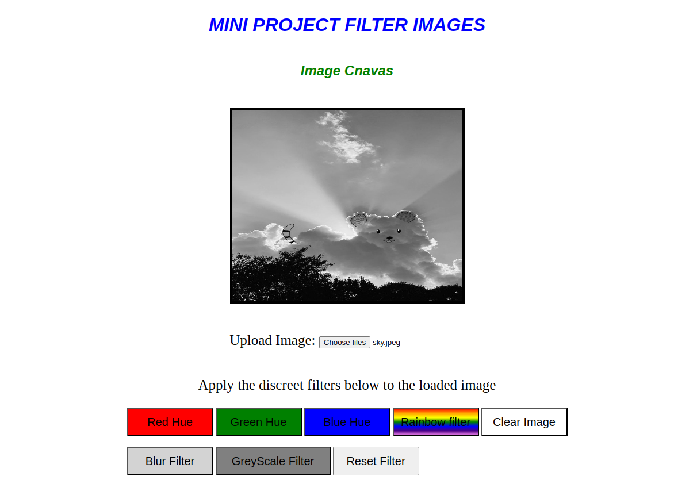

# FilterFun - Playful Image Filtering Project
This is just a fun project where we can upload our pictures and apply various filters to it.

**Prerequisites:** Basic understanding of HTML, CSS, and JavaScript is helpful.

## Technical Details
FilterFun leverages these technologies:
- HTML: Provides the web page's structure and content.
- CSS: Styles user interface elements for a visually appealing experience.
- JavaScript: Handles user interactions, image manipulation (filters), and dynamic page updates.

## Using FilterFun
FilterFun offers a user-friendly interface for image uploads and filter application:
1. Click "Choose File" for an image.
2. The selected image will be displayed.
3. Click on a filter button from available options (Red Hue, Green Hue, Rainbow Filter, Blur Filter, GreyScale Filter, etc.).
4. Experiment with filters for your desired effect.

### [Live Demo](https://filter-fun-canvas.vercel.app/) on Vercel

  

## Customization
Feel free to customize FilterFun by:
- Adding new filters (explore JavaScript image processing libraries).
- Enhancing the user interface design (modify CSS styles).
- Implementing additional features like saving filtered images or social media sharing.

